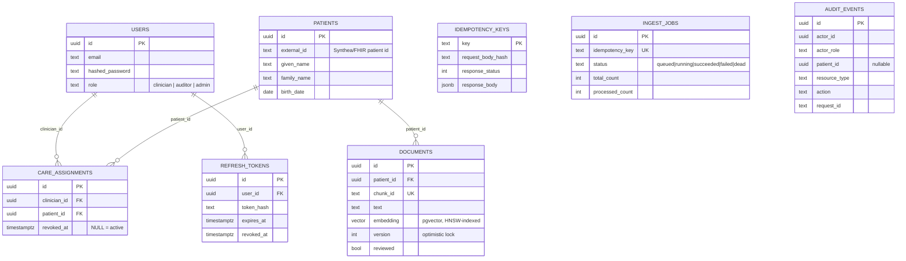

# Architecture — clinical-evidence-api

This document covers the data model, the request lifecycle, why each
dependency is in the stack, the zero-downtime migration pattern used in
this repo, and a failure-modes table. For the authorization model
specifically (RLS, `SET LOCAL`), see the README's "Authorization model"
section — it's covered there because it's the single most important
thing a reviewer should read, not because it's less architectural.

## Data model



`AUDIT_EVENTS` deliberately has no drawn foreign keys to `USERS`/`PATIENTS`
in the diagram above — an audit row has to remain readable even if the
actor or patient it references is later deleted (the app never deletes
either today, but the audit table's job is to outlive the row it's about
either way, so it stores ids, not enforced references).

## Request lifecycle

A representative `POST /v1/patients/{id}/query`:

```mermaid
sequenceDiagram
    participant C as Client
    participant MW as RequestContextMiddleware
    participant R as Route (query.py)
    participant PG as Postgres
    participant Redis
    participant LLM as LLM (or NullClient)

    C->>MW: POST /v1/patients/{id}/query (+ JWT)
    MW->>MW: generate/accept request_id
    MW->>R: dispatch, actor resolved from JWT
    R->>PG: BEGIN; SET LOCAL app.actor_id = :actor
    R->>PG: SELECT care_assignments (authorization check)
    alt not assigned
        R-->>C: 403 problem+json
    end
    R->>Redis: rate-limit check (Lua token bucket)
    R->>PG: SELECT ... ORDER BY embedding <=> :q LIMIT k  (RLS-enforced)
    R->>R: PHI redaction, prompt build
    R->>LLM: generate() [circuit-breaker gated, timeout]
    LLM-->>R: answer text
    R->>R: grounding check, re-hydrate PHI
    R->>PG: INSERT audit_events (same transaction)
    R->>PG: COMMIT
    R-->>C: 200 QueryResponse
```

The authorization check and the retrieval query are both scoped inside
this one transaction — there is no window where a query runs before the
actor's identity (and therefore RLS) is established.

## Every dependency, justified

| Dependency | Why this, not something else |
|---|---|
| **FastAPI** | Async-native, Pydantic v2 request/response validation gives the OpenAPI schema (and its examples) almost for free — the spec's "`/docs` looks like a product" requirement is mostly FastAPI doing its job. |
| **Pydantic v2** | Faster (Rust core) than v1, and its `model_config.json_schema_extra` is how every endpoint's OpenAPI example is attached without a second schema-authoring system. |
| **Postgres 16 + pgvector** | One database for relational data (users, assignments, audit) *and* vector search (`documents.embedding`), rather than a relational store plus a separate vector database — one fewer moving part, one transaction spans both. pgvector's HNSW index (added in 0.5+) is what makes vector search at scale not a sequential scan; see `benchmarks/README.md`. |
| **Alembic** | The de facto standard for SQLAlchemy migrations; `alembic upgrade head` / `downgrade -1` in CI is the whole reason to have it. |
| **Redis** | Backs the arq queue and the token-bucket rate limiter (atomic via a Lua script) — two jobs, one dependency, rather than justifying a second in-memory store for either one alone. |
| **arq** | See `docs/adr/0003-arq-over-celery.md`. |
| **PyJWT + bcrypt** | Minimal, well-audited primitives for the two things auth actually needs (sign/verify a token, hash/verify a password) — no framework needed on top. |
| **prometheus-client** | The metrics format every standard Grafana/Alertmanager setup expects; `/metrics` is a one-file integration. |
| **httpx** | Async HTTP client used by the test suite (`AsyncClient` + `ASGITransport`) to drive the app in-process without a real socket. |
| **pytest + pytest-asyncio + testcontainers** | Real Postgres/Redis per the spec ("no mocked database" — RLS bugs don't exist in a mock) and async test support. |
| **ruff + mypy --strict** | One fast linter, one strict type checker; both run in CI and both pass — see the CI workflow. |
| **k6** | Load-testing tool with a scripting model expressive enough for the auth-once-per-VU, realistic-query-mix pattern in `benchmarks/k6_query_load.js`, and JSON summary export for the before/after table. |

## API versioning and deprecation policy

`/v1` from commit one. This service has never shipped a `/v2`, so the
policy below is written but untested in practice — worth stating anyway,
since "what's your deprecation policy" is a fair question to ask before
it's needed:

1. A new, incompatible version ships as `/v2`; `/v1` keeps running unchanged.
2. `/v1` responses gain a `Deprecation` and `Sunset` header (RFC 8594) the
   day `/v2` ships, naming a concrete removal date at least 90 days out.
3. `/v1` is removed only after that date, and only after usage metrics
   (`http_request_duration_seconds{route=~"/v1/.*"}`) show it's actually
   gone quiet — not on the calendar date alone if traffic says otherwise.

## Zero-downtime schema changes

Migrations 0004–0006 are a worked example: adding
`documents.reviewed BOOLEAN NOT NULL DEFAULT false` to a table that
already has rows.

Doing this in one step — `ALTER TABLE documents ADD COLUMN reviewed
BOOLEAN NOT NULL DEFAULT false` — either fails outright (older Postgres
versions needed the column nullable before a rewrite) or, even where
Postgres 16 can add a non-null column with a *constant* default without a
full rewrite, still takes `ACCESS EXCLUSIVE` for the duration of the DDL
statement: every concurrent read and write against `documents` queues
behind it. On a table serving live traffic, that's a stall, not "just a
migration."

The three-step pattern instead:

1. **0004 — add nullable.** `ADD COLUMN reviewed BOOLEAN` with no
   `NOT NULL`, no default. Metadata-only change, near-instant, safe to
   deploy while the *old* application code (which doesn't know the column
   exists) is still running.
2. **0005 — backfill.** `UPDATE documents SET reviewed = false WHERE
   reviewed IS NULL`, batched (see the migration for the loop) so no
   single transaction holds a lock proportional to the whole table. Runs
   after step 1 is deployed everywhere, before step 3 ships.
3. **0006 — enforce.** `ALTER COLUMN reviewed SET NOT NULL`. Now that
   every row already satisfies the constraint (step 2 finished first),
   Postgres 16 can validate this without a table rewrite — it's a
   metadata change plus a scan to confirm no violations exist, not a
   rewrite of every row.

Each step is its own migration, its own deploy. Skipping straight to step
3 before step 2 has finished running fails the constraint outright, which
is the mechanism keeping the order honest.

## Failure modes

| Failure | What the client/user sees | How it recovers |
|---|---|---|
| Postgres unreachable | `/readyz` → 503; in-flight requests → 500 (problem+json) | `pool_pre_ping` detects dead connections; k8s/compose healthcheck restarts or stops routing traffic; no data loss (transactions either committed or rolled back cleanly) |
| Redis unreachable | `/readyz` → 503; rate limiter calls raise, surfaced as 500 | Redis reconnects automatically via redis-py's connection pool; rate-limit state is not authoritative data, safe to lose and rebuild |
| LLM provider down/slow | Circuit breaker opens after 5 consecutive failures; `/query` degrades to 200 retrieval-only (`docs/adr/0004`) | Breaker half-opens after 30s cooldown, probes with the next request; closes again on success |
| Worker crashes mid-job | `GET /v1/ingest/jobs/{id}` shows the job's last committed progress, never silently vanishes | arq retries (jittered backoff) up to `ingest_max_retries`; final failure lands in `dead` with a stored traceback (see `tests/integration/test_ingest_worker_crash_recovery.py`) |
| Concurrent PATCH to the same document | One request gets 200, the other(s) get 409 | Client refetches the current ETag and retries — no data corruption, no lost update |
| Idempotency-Key reused with a different body | 422, request rejected | Client bug surfaced immediately rather than silently duplicating or silently ignoring work |
| Rate limit exceeded | 429 with `Retry-After` | Client backs off and retries after the indicated window |
| Audit write fails | The *read* it would have documented also fails (500) — see `docs/adr/0005` | Client retries; either both the read and its audit row land, or neither does |
| A future migration forgets an authorization check | RLS still blocks the query at the database level | No recovery needed — the belt-and-suspenders design means this class of bug can't leak data even when it happens |

## What breaks at 100x

See the README's "What breaks at 100x" section for the forward-looking
version of this table — this one is about failures the system already
handles; that one is about where today's design stops scaling.
